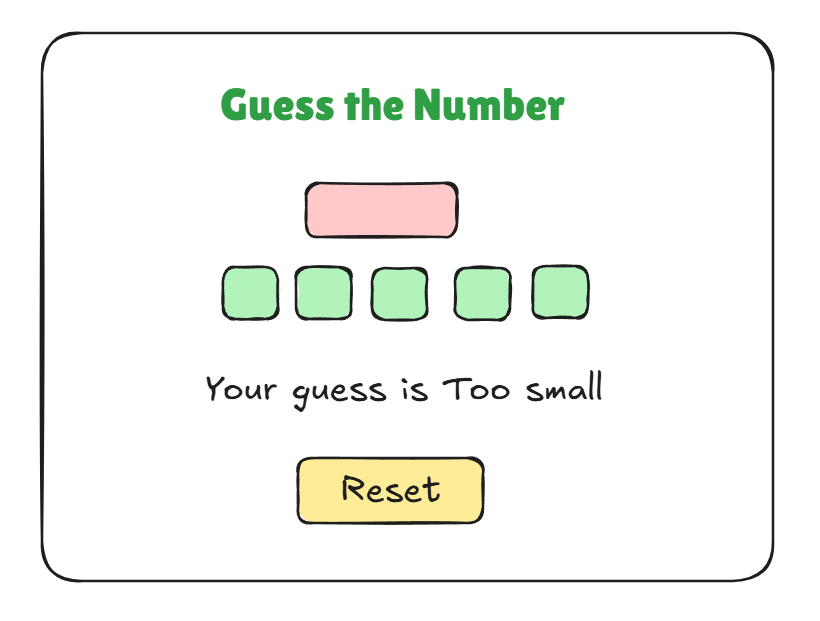

# Number Guessing Game 🎮

A fun and interactive number guessing game built with HTML, CSS, and JavaScript. Players need to guess a random number within a specified range.

## Features ✨

- Random number generation
- Score tracking
- High score system
- Responsive design
- User-friendly interface
- Visual feedback for correct/incorrect guesses

## Screenshot 📸

## How to Play 🎯

1. Open the game in your web browser
2. Enter your guess in the input field
3. Click the "Check" button or press Enter
4. Get feedback on whether your guess is too high or too low
5. Keep guessing until you find the correct number
6. Try to achieve the highest score possible!

## Technologies Used 🛠️

- HTML5
- CSS3
- JavaScript (Vanilla)

## Getting Started 🚀

1. Clone this repository
2. Open `index.html` in your web browser
3. Start playing!

## Live Demo 🔗

[Play the game here](https://your-live-demo-url.com)

## Contributing 🤝

Contributions are welcome! Please feel free to submit a Pull Request.

## License 📄

This project is licensed under the MIT License - see the LICENSE file for details.
